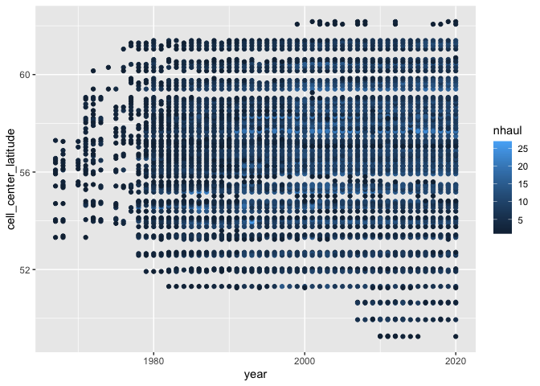
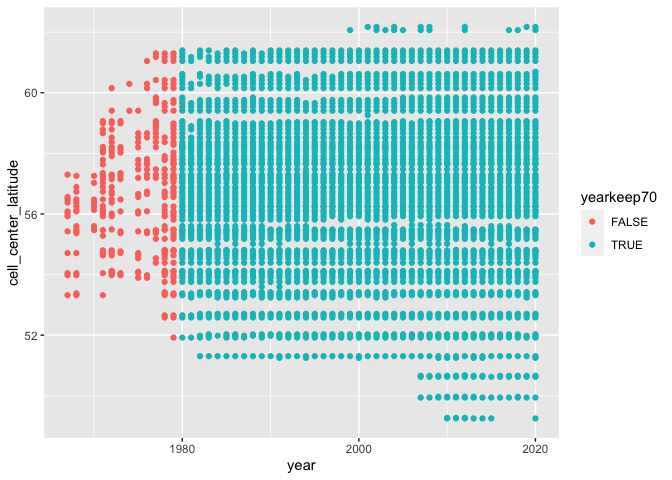
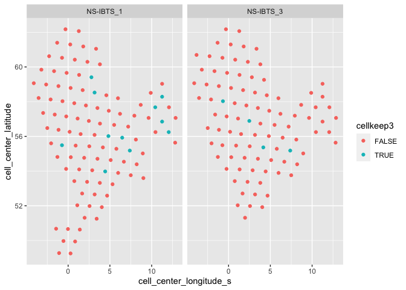
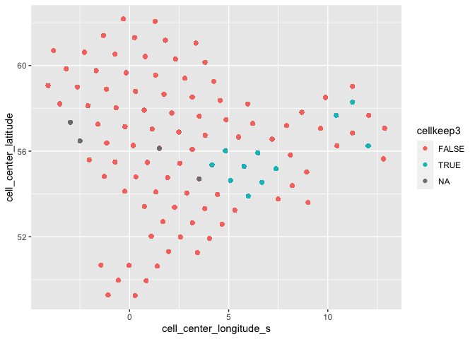

Exploring North Sea data trimming
================

``` r
library(dggridR)
```

    ## Loading required package: dplyr

    ## Warning: package 'dplyr' was built under R version 4.0.5

    ## 
    ## Attaching package: 'dplyr'

    ## The following objects are masked from 'package:stats':
    ## 
    ##     filter, lag

    ## The following objects are masked from 'package:base':
    ## 
    ##     intersect, setdiff, setequal, union

    ## Loading required package: rlang

    ## Warning: package 'rlang' was built under R version 4.0.5

    ## Loading required package: sf

    ## Warning: package 'sf' was built under R version 4.0.5

    ## Linking to GEOS 3.9.1, GDAL 3.4.0, PROJ 8.1.1; sf_use_s2() is TRUE

    ## Loading required package: sp

``` r
library(data.table)
```

    ## 
    ## Attaching package: 'data.table'

    ## The following object is masked from 'package:rlang':
    ## 
    ##     :=

    ## The following objects are masked from 'package:dplyr':
    ## 
    ##     between, first, last

``` r
library(rgdal)
```

    ## rgdal: version: 1.5-23, (SVN revision 1121)
    ## Geospatial Data Abstraction Library extensions to R successfully loaded
    ## Loaded GDAL runtime: GDAL 3.2.1, released 2020/12/29
    ## Path to GDAL shared files: /Library/Frameworks/R.framework/Versions/4.0/Resources/library/rgdal/gdal
    ## GDAL binary built with GEOS: TRUE 
    ## Loaded PROJ runtime: Rel. 7.2.1, January 1st, 2021, [PJ_VERSION: 721]
    ## Path to PROJ shared files: /Library/Frameworks/R.framework/Versions/4.0/Resources/library/rgdal/proj
    ## PROJ CDN enabled: FALSE
    ## Linking to sp version:1.4-5
    ## To mute warnings of possible GDAL/OSR exportToProj4() degradation,
    ## use options("rgdal_show_exportToProj4_warnings"="none") before loading rgdal.
    ## Overwritten PROJ_LIB was /Library/Frameworks/R.framework/Versions/4.0/Resources/library/rgdal/proj

``` r
library(raster)
```

    ## 
    ## Attaching package: 'raster'

    ## The following object is masked from 'package:data.table':
    ## 
    ##     shift

    ## The following object is masked from 'package:dplyr':
    ## 
    ##     select

``` r
library(sp)
#library(rnaturalearth)
#library(rnaturalearthdata)
#library(rgeos)
#library(taxize) #standardizing names
#library(geosphere)  #to calculate distance between lat lon of grid cells
#library(googledrive)
library(here)
```

    ## here() starts at /Users/mpinsky/Documents/Rutgers/Community_and_climate/trawl_spatial_turnover

``` r
library(sf)
library(ggplot2) # for plotting
```

Pull in compiled and cleaned data from fishglob February 4, 2022

``` r
#load if already saved
FishGlob <- fread(file = here::here("temp", "FISHGLOB_v1.1_clean.csv"))
```

Get rid of any survey x season combos not sampled for at least 10 years

``` r
#new row for total number of years sampled
nyrs <- FishGlob[,.(years_sampled = length(unique(year))),.(survey,season)]
nyrs[order(years_sampled),]
```

    ##       survey season years_sampled
    ##  1:  ICE-GFS      2             2
    ##  2:  DFO-SOG   <NA>             2
    ##  3:      MRT     SC             5
    ##  4:     WBLS   <NA>             6
    ##  5:      MRT     CF             7
    ##  6:   DFO-HS   <NA>             8
    ##  7:   IS-TAU   <NA>             8
    ##  8:      MRT     SF             8
    ##  9:      SCS   FALL             8
    ## 10: DFO-WCHG   <NA>             8
    ## 11: DFO-WCVI   <NA>             8
    ## 12:      COL   <NA>             9
    ## 13:  DFO-QCS   <NA>            10
    ## 14:    WCTRI   <NA>            10
    ## 15:      GIN      1            12
    ## 16:       AI   <NA>            14
    ## 17:  PT-IBTS   <NA>            14
    ## 18:    NIGFS   <NA>            16
    ## 19:      GOA   <NA>            16
    ## 20:    WCANN   <NA>            16
    ## 21:      CHL      2            17
    ## 22:  IS-MOAG   <NA>            17
    ## 23:  IE-IGFS   <NA>            18
    ## 24:      GIN      2            18
    ## 25:  ROCKALL   <NA>            19
    ## 26:     FALK   <NA>            19
    ## 27:      NAM   <NA>            21
    ## 28:  S-GEORG   <NA>            21
    ## 29:      ZAF      1            22
    ## 30:  FR-CGFS   <NA>            23
    ## 31:    EVHOE   <NA>            24
    ## 32:      ZAF      2            24
    ## 33:   DFO-NF   Fall            25
    ## 34:  ICE-GFS      1            26
    ## 35:   MEDITS   <NA>            26
    ## 36:     BITS   <NA>            29
    ## 37:       NZ   <NA>            30
    ## 38:     SEUS spring            31
    ## 39:     SEUS summer            31
    ## 40:     SEUS   fall            31
    ## 41:     GMEX   Fall            33
    ## 42:     GMEX Summer            33
    ## 43: SWC-IBTS   <NA>            36
    ## 44:   GRL-DE   <NA>            37
    ## 45:      EBS   <NA>            38
    ## 46:  Nor-BTS   <NA>            38
    ## 47:    GSL-N   <NA>            39
    ## 48:      SCS SPRING            42
    ## 49:    GSL-S   <NA>            49
    ## 50:      SCS SUMMER            51
    ## 51:  NS-IBTS   <NA>            53
    ## 52:     NEUS Spring            53
    ## 53:     NEUS   Fall            57
    ##       survey season years_sampled

``` r
hist(nyrs$years_sampled)
```

<!-- -->

``` r
length(unique(FishGlob[,survey])) # 42 survey x season
```

    ## [1] 42

``` r
#remove observations for any regions x season combinations sampled less than 10 times and observations not resolved to species
FishGlob[, years_sampled := length(unique(year)),.(survey,season)]
FishGlob.10year <- FishGlob[years_sampled >= 10,][rank == "Species",]

length(unique(FishGlob.10year[,survey]))
```

    ## [1] 34

``` r
rm(FishGlob)
```

Trim to North Sea

``` r
FishGlob.10year.r <- FishGlob.10year[survey == "NS-IBTS",]

rm(FishGlob.10year)

#add column with season and survey
FishGlob.10year.r[,survey_season := as.factor(paste0(survey,"_",season))]

all_survey_seasons <- levels(FishGlob.10year.r[,survey_season])
```

Loop to standardize observations for all regions

``` r
#world map
world <- data.table(map_data('world'))
world[,long_s := ifelse(long > 150, (long-360),(long))]


#if positive, subtract 360
FishGlob.10year.r[,longitude_s := ifelse(longitude > 150,(longitude-360),(longitude))]

#delete if NA for longitude or latitude
FishGlob.10year.r <- FishGlob.10year.r[complete.cases(FishGlob.10year.r[,.(longitude, latitude)])]

#set up grid
dggs <- dgconstruct(res = 8, metric = T) #with res = 8, we will need at least 3 observations per year within 7,774.2 km^2 (roughly size of some NEUS strata)

map_points_plots <- list()

FishGlob_cleaned <- data.table()

  #pull out unique lat lons
  unique_latlon <- unique(FishGlob.10year.r[,.(latitude, longitude_s)])
  
  unique_latlon[,cell := dgGEO_to_SEQNUM(dggs, longitude_s, latitude)] #get corresponding grid cells for this region/survey combo

  #find cell centers
  cellcenters <- dgSEQNUM_to_GEO(dggs, unique_latlon[,cell])

  #linking cell centers to unique_latlon
  unique_latlon[,cell_center_longitude_s := cellcenters$lon_deg][,cell_center_latitude:= cellcenters$lat_deg]

    #link centers back to main data table
  FishGlob.10year.r <- merge(FishGlob.10year.r, unique_latlon, by = c("latitude", "longitude_s"), all.x = TRUE)

  #number of tows in each cell
  #towcount <- unique_latlon[, .N, by = cell]
  #towcount <- FishGlob.10year.r[, .(ntow = length(unique(haul_id))), by = cell]

  #get the grid cell boundary for cells which had trawls
  #grid <- dgcellstogrid(dggs, unique_latlon[,cell])

  #update grid properties to include # of trawls in each cell
  #grid <- merge(grid, unique_latlon, by = "cell")
  #grid <- merge(grid, towcount, by.x = "seqnum", by.y = "cell")
  
  #Any years where clearly fewer cells were sampled?
  year_cells <- FishGlob.10year.r[,.(cell_count = length(unique(cell))), by = .(year)]
  
  benchmark_70 <- 0.7 * max(year_cells[,cell_count]) # of cells/ year to cut off below
  
  #only keep years where over 70% of cells are sampled
  year_cells[,benchmark_70 := cell_count > benchmark_70]
  
  years_deleted <- year_cells[benchmark_70 == F]$year #which years are left out?
  
  years_kept <- year_cells[benchmark_70 ==T]$year #which years  to keep
  
  years_deleted_percent <- round(length(years_deleted)/nrow(year_cells)*100,1)
  
  # mark in FishGlob
  FishGlob.10year.r[year %in% years_deleted, yearkeep70 := FALSE]
  FishGlob.10year.r[year %in% years_kept, yearkeep70 := TRUE]
  
  #print  the years that are left out
  print(ifelse(length(years_deleted) == 0, paste0(all_survey_seasons, " Years left out = 0"), paste0(all_survey_seasons, " Years left out = ", paste(years_deleted, collapse=','), ", ",years_deleted_percent, "% of Years Excluded"))) #need to figure out how to list all years removed
```

    ## [1] "NS-IBTS_NA Years left out = 1979,1978,1968,1971,1967,1975,1976,1972,1973,1977,1970,1974, 22.6% of Years Excluded"

Plot \#hauls by cell and year. Second plot shows whether year is kept or
not.

``` r
  # table of years by cells, count is # hauls
  yearcell_table <- FishGlob.10year.r[, .(nhaul = length(unique(haul_id))), by = .(cell, year, cell_center_latitude, cell_center_longitude_s, yearkeep70)]

# color by #hauls
  ggplot(yearcell_table, aes(year, cell_center_latitude, color = nhaul)) +
    geom_point()
```

<!-- -->

``` r
# color by keep or not at 70% threshold
  ggplot(yearcell_table, aes(year, cell_center_latitude, color = yearkeep70)) +
    geom_point()
```

<!-- -->

Plot \#years by cell

``` r
  # table of years by cells, count is # hauls
  cell_table <- FishGlob.10year.r[, .(nyear = length(unique(year))), by = .(cell, cell_center_latitude, cell_center_longitude_s)]
  ggplot(cell_table, aes(cell_center_longitude_s, cell_center_latitude, color = nyear)) +
    geom_point()
```

<!-- -->
\#

``` r
  #identify any cells that in any remaining years are sampled less than 3 times
  FishGlob.10year.r[,year_cell_count := length(unique(haul_id)),.(year,cell)]
  
  #cell ids to remove and keep
  #which cells are sampled less than 3 times in any remaining year: these need to go
  FishGlob.10year.r[, yearcellkeep3 := year_cell_count > 3] # TRUE if >3 hauls in a year x cell
  FishGlob.10year.r[yearkeep70 == TRUE, cellkeep3 := !any(!yearcellkeep3), by = cell] # TRUE if any remaining years fail the yearcellkeep3 threshold
  
  #make a map of these points
  ggplot(FishGlob.10year.r, aes(cell_center_longitude_s, cell_center_latitude, color = cellkeep3)) +
    geom_point()
```

<!-- -->
