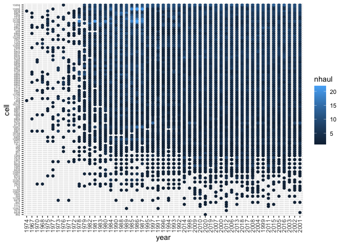
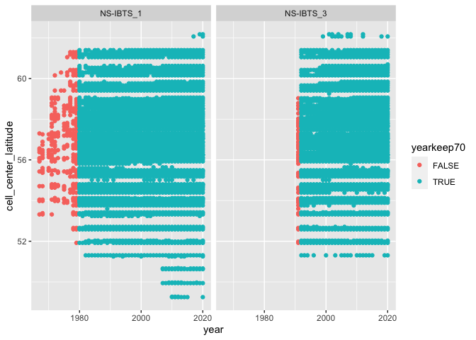
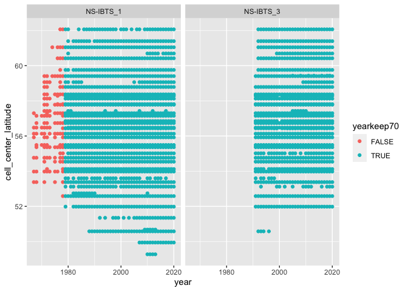
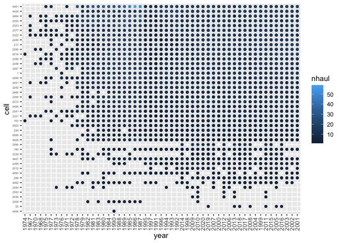
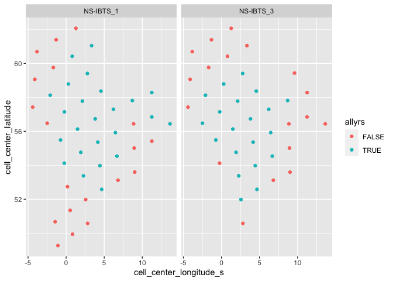
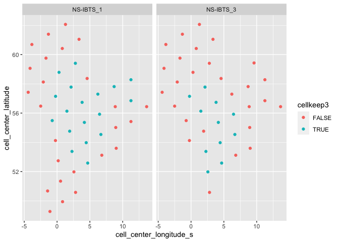

Exploring North Sea data trimming
================

  - [Load data](#load-data)
  - [Standardize trawl footprint](#standardize-trawl-footprint)
      - [Hex size 8](#hex-size-8)
          - [Plot num hauls per cell and
            year](#plot-num-hauls-per-cell-and-year)
          - [Trim out years with \<70% cells in a
            survey](#trim-out-years-with-70-cells-in-a-survey)
          - [Plot num years by cell](#plot-num-years-by-cell)
          - [Mark cells sampled \>=3x each remaining
            year](#mark-cells-sampled-3x-each-remaining-year)
      - [Hex size 7](#hex-size-7)
          - [Plot num hauls per cell and
            year](#plot-num-hauls-per-cell-and-year-1)
          - [Trim out years with \<70% cells in a
            survey](#trim-out-years-with-70-cells-in-a-survey-1)
          - [Plot num years by cell](#plot-num-years-by-cell-1)
          - [Mark cells sampled \>=3x each remaining
            year](#mark-cells-sampled-3x-each-remaining-year-1)

``` r
library(dggridR)
```

    ## Loading required package: dplyr

    ## Warning: package 'dplyr' was built under R version 4.0.5

    ## 
    ## Attaching package: 'dplyr'

    ## The following objects are masked from 'package:stats':
    ## 
    ##     filter, lag

    ## The following objects are masked from 'package:base':
    ## 
    ##     intersect, setdiff, setequal, union

    ## Loading required package: rlang

    ## Warning: package 'rlang' was built under R version 4.0.5

    ## Loading required package: sf

    ## Warning: package 'sf' was built under R version 4.0.5

    ## Linking to GEOS 3.9.1, GDAL 3.4.0, PROJ 8.1.1; sf_use_s2() is TRUE

    ## Loading required package: sp

``` r
library(data.table)
```

    ## 
    ## Attaching package: 'data.table'

    ## The following object is masked from 'package:rlang':
    ## 
    ##     :=

    ## The following objects are masked from 'package:dplyr':
    ## 
    ##     between, first, last

``` r
#library(rgdal)
#library(raster)
#library(sp)
library(here)
```

    ## here() starts at /Users/mpinsky/Documents/Rutgers/Community_and_climate/trawl_spatial_turnover

``` r
#library(sf)
library(ggplot2) # for plotting
library(gridExtra) # for arranging plots
```

    ## 
    ## Attaching package: 'gridExtra'

    ## The following object is masked from 'package:dplyr':
    ## 
    ##     combine

# Load data

Pull in compiled and cleaned data from fishglob February 4, 2022  
Trim to North Sea and divide into quarters 1 and 3

``` r
FishGlob <- fread(file = here::here("temp", "FISHGLOB_v1.1_clean.csv"))
FishGlob <- FishGlob[survey == "NS-IBTS",]
FishGlob[,survey_season := as.factor(paste0(survey,"_",quarter))] # quarter indicates season
FishGlob[, summary(survey_season)]
```

    ## NS-IBTS_1 NS-IBTS_3 
    ##    228975    135189

``` r
#if positive, subtract 360
FishGlob[,longitude_s := ifelse(longitude > 150,(longitude-360),(longitude))]

#delete if NA for longitude or latitude
FishGlob <- FishGlob[complete.cases(FishGlob[,.(longitude, latitude)])]
```

# Standardize trawl footprint

## Hex size 8

``` r
#if positive, subtract 360
FishGlob[,longitude_s := ifelse(longitude > 150,(longitude-360),(longitude))]

#delete if NA for longitude or latitude
FishGlob <- FishGlob[complete.cases(FishGlob[,.(longitude, latitude)])]

#set up grid
dggs <- dgconstruct(res = 8, metric = T) #with res = 8, we will need at least 3 observations per year within 7,774.2 km^2 (roughly size of some NEUS strata)

#pull out unique lat lons and get grid cells
unique_latlon <- unique(FishGlob[,.(latitude, longitude_s)])
unique_latlon[,cell := dgGEO_to_SEQNUM(dggs, longitude_s, latitude)] #get corresponding grid cells for this region/survey combo

#find cell centers
cellcenters <- dgSEQNUM_to_GEO(dggs, unique_latlon[,cell])

#linking cell centers to unique_latlon
unique_latlon[,cell_center_longitude_s := cellcenters$lon_deg][,cell_center_latitude:= cellcenters$lat_deg]

#link centers back to main data table
FishGlob.dg <- merge(FishGlob, unique_latlon, by = c("latitude", "longitude_s"), all.x = TRUE)
```

### Plot num hauls per cell and year

Red lines maximize the number of cell x years without any missing.  
Purple lines maximize the number of cell x years with \<5% missing.

``` r
# make a list of all unique year x cell x survey
year_cell_count.dt <- as.data.table(expand.grid(cell = unique(FishGlob.dg$cell), 
                                                year = unique(FishGlob.dg$year), 
                                                survey_season = unique(FishGlob.dg$survey_season))) 

# calc num hauls per year x cell x survey, then merge to full list
temp <- FishGlob.dg[, .(nhaul = length(unique(haul_id))), by = .(cell, year, survey_season)]
year_cell_count.dt <- merge(year_cell_count.dt, temp, all.x = TRUE)
year_cell_count.dt[is.na(nhaul), nhaul := 0] # fill in for year x cell x survey that aren't present

# loop through each survey x season. Couldn't figure out how to do this without a loop.
survseas <- FishGlob.dg[, unique(survey_season)]
plots <- vector('list', length(survseas))
for(i in 1:length(survseas)){
  # trim to this survey
  thisyearcellcount <- year_cell_count.dt[survey_season == survseas[i],]
  
  # calculate the most to least sampled cells and years
  year_order <- thisyearcellcount[nhaul >0, .(ncell = length(unique(cell))), 
                                     by = year][ncell >0,][order(ncell),]
  cell_order <- thisyearcellcount[nhaul > 0, .(nyear = length(unique(year))), 
                                     by = cell][nyear >0,][order(nyear),]
  
  # set the factor order by ave number of hauls
  thisyearcellcount[, year := factor(year, levels = year_order$year)]
  thisyearcellcount[, cell := factor(cell, levels = cell_order$cell)]
  
  # calculate num missing cells x years for different thresholds. slow.
  cutoffs <- data.table(expand.grid(year = levels(thisyearcellcount$year), cell = levels(thisyearcellcount$cell)))
  cutoffs[, ':='(ntot = NA_integer_, nmiss = NA_integer_, nkeep = NA_integer_)]
  nyr <- length(unique(cutoffs$year))
  ncl <- length(unique(cutoffs$cell))
  for(j in 1:nyr){
    for(k in 1:ncl){
      thisntot <- thisyearcellcount[cell %in% levels(cell)[k:ncl] & year %in% levels(year)[j:nyr], .N]
      thisnmiss <- thisyearcellcount[cell %in% levels(cell)[k:ncl] & year %in% levels(year)[j:nyr], sum(nhaul == 0)]
      thisnkeep <- thisyearcellcount[cell %in% levels(cell)[k:ncl] & year %in% levels(year)[j:nyr], sum(nhaul > 0)]
      cutoffs[cell == thisyearcellcount[, levels(cell)[k]] &
                year == thisyearcellcount[,levels(year)[j]],
              ':='(ntot = thisntot, nmiss = thisnmiss, nkeep = thisnkeep)]
    }
  }
  
  # choose a threshold 
  chosencutoffs0 <- cutoffs[nmiss==0,][nkeep == max(nkeep),] # based on nothing missing
  chosencutoffs02 <- cutoffs[nmiss/ntot < 0.02,][nkeep == max(nkeep),] # based on <2% missing
  
  # print out the cells and years to keep
  print(paste0('For ', survseas[i], ' 0% missing'))
  print(paste0('Keep these years:', 
               paste0(thisyearcellcount[, levels(year)[as.numeric(chosencutoffs0$year):nyr]], collapse=',')))
  print(paste0('Keep these cells:', 
               paste0(thisyearcellcount[, levels(cell)[as.numeric(chosencutoffs0$cell):ncl]], collapse = ',')))
  print(paste0('Drop these years:', 
               paste0(thisyearcellcount[, levels(year)[1:as.numeric(chosencutoffs0$year)]], collapse=',')))
  print(paste0('Drop these cells:', 
               paste0(thisyearcellcount[, levels(cell)[1:as.numeric(chosencutoffs0$cell)]], collapse = ',')))
  
  print(paste0('For ', survseas[i], ' 2% missing'))
  print(paste0('Keep these years:', 
               paste0(thisyearcellcount[, levels(year)[as.numeric(chosencutoffs02$year):nyr]], collapse = ',')))
  print(paste0('Keep these cells:', 
               paste0(thisyearcellcount[, levels(cell)[as.numeric(chosencutoffs02$cell):ncl]], collapse = ',')))
  print(paste0('Drop these years:', 
               paste0(thisyearcellcount[, levels(year)[1:as.numeric(chosencutoffs02$year)]], collapse=',')))
  print(paste0('Drop these cells:', 
               paste0(thisyearcellcount[, levels(cell)[1:as.numeric(chosencutoffs02$cell)]], collapse = ',')))
  
  # make plot
  plots[[i]] <- ggplot(thisyearcellcount[nhaul > 0,], aes(year, cell, color = nhaul)) +
    geom_point() + 
    theme(axis.text.x = element_text(angle = 90, vjust = 0.5, hjust=1, size = 4),
          axis.text.y = element_text(size = 5)) +
    labs(title = survseas[i]) +
    geom_vline(xintercept = chosencutoffs0[, as.numeric(year)], color = 'red') +
    geom_hline(yintercept = chosencutoffs0[, as.numeric(cell)], color = 'red') +
    geom_vline(xintercept = chosencutoffs02[, as.numeric(year)], color = 'purple') +
    geom_hline(yintercept = chosencutoffs02[, as.numeric(cell)], color = 'purple')
}
```

    ## [1] "For NS-IBTS_1 0% missing"
    ## [1] "Keep these years:1997,1998,1999,2006,1987,1988,1990,1994,2000,2001,2003,2004,1989,1993,1996,2002,2007,2015,1991,2008,2014,2009,2013,2016,2017,2012,2018,2019,2011,2010,2020"
    ## [1] "Keep these cells:648,649,6637,13285,13366,19765,6717,6724,7048,7372,13196,13204,13280,567,6636,6797,6798,6800,6882,7290,13198,13199,13200,13281,568,6716,6718,6719,6799,6802,6881,6883,6886,6962,6963,6964,7126,7127,7208,6638,6721,6801,6803,6805,6885,6961,6967,7044,7045,7047,7129,7291,6720,6804,6880,6884,6966,7046,6965,7128,7209,7210"
    ## [1] "Drop these years:1974,1970,1967,1973,1968,1976,1975,1977,1971,1972,1978,1979,1981,1982,1980,1984,1983,1995,2005,1985,1986,1992,1997"
    ## [1] "Drop these cells:7613,13362,566,647,7776,13203,13447,7695,6879,7777,13194,82,7614,7615,7696,13282,7043,7125,13197,6634,6722,6715,13201,811,7452,13284,6643,729,7207,730,7371,7453,7534,13195,6635,7289,19764,487,1,486,648"
    ## [1] "For NS-IBTS_1 2% missing"
    ## [1] "Keep these years:1981,1982,1980,1984,1983,1995,2005,1985,1986,1992,1997,1998,1999,2006,1987,1988,1990,1994,2000,2001,2003,2004,1989,1993,1996,2002,2007,2015,1991,2008,2014,2009,2013,2016,2017,2012,2018,2019,2011,2010,2020"
    ## [1] "Keep these cells:6643,729,7207,730,7371,7453,7534,13195,6635,7289,19764,487,1,486,648,649,6637,13285,13366,19765,6717,6724,7048,7372,13196,13204,13280,567,6636,6797,6798,6800,6882,7290,13198,13199,13200,13281,568,6716,6718,6719,6799,6802,6881,6883,6886,6962,6963,6964,7126,7127,7208,6638,6721,6801,6803,6805,6885,6961,6967,7044,7045,7047,7129,7291,6720,6804,6880,6884,6966,7046,6965,7128,7209,7210"
    ## [1] "Drop these years:1974,1970,1967,1973,1968,1976,1975,1977,1971,1972,1978,1979,1981"
    ## [1] "Drop these cells:7613,13362,566,647,7776,13203,13447,7695,6879,7777,13194,82,7614,7615,7696,13282,7043,7125,13197,6634,6722,6715,13201,811,7452,13284,6643"
    ## [1] "For NS-IBTS_3 0% missing"
    ## [1] "Keep these years:1998,1994,1992,2002,2004,2011,1999,2003,2005,2016,2001,2009,2013,2014,2018,2019,2020,2007,2010,2015,2017,2006,2012,2008"
    ## [1] "Keep these cells:7045,13284,1,486,487,648,649,6636,6637,6638,6716,6717,6721,6724,6880,7044,7046,7126,7127,7128,13204,13285,13366,19764,19765,6719,6720,6799,6800,6801,6802,6803,6881,6882,6883,6884,6885,6886,6962,6963,6964,6965,6966,6967,7047,7048,7129,7208,7209,7210,7290,7291,7372,7453,13195,13196,13198,13199,13200"
    ## [1] "Drop these years:1991,1997,1995,1996,1993,2000,1998"
    ## [1] "Drop these cells:892,6639,7125,13362,13201,13282,7043,13447,647,7371,13280,566,82,6722,6715,6634,13281,7534,13203,811,730,6635,6797,6961,7289,729,7207,567,568,6643,6718,6804,7452,6798,6805,7045"
    ## [1] "For NS-IBTS_3 2% missing"
    ## [1] "Keep these years:1997,1995,1996,1993,2000,1998,1994,1992,2002,2004,2011,1999,2003,2005,2016,2001,2009,2013,2014,2018,2019,2020,2007,2010,2015,2017,2006,2012,2008"
    ## [1] "Keep these cells:7289,729,7207,567,568,6643,6718,6804,7452,6798,6805,7045,13284,1,486,487,648,649,6636,6637,6638,6716,6717,6721,6724,6880,7044,7046,7126,7127,7128,13204,13285,13366,19764,19765,6719,6720,6799,6800,6801,6802,6803,6881,6882,6883,6884,6885,6886,6962,6963,6964,6965,6966,6967,7047,7048,7129,7208,7209,7210,7290,7291,7372,7453,13195,13196,13198,13199,13200"
    ## [1] "Drop these years:1991,1997"
    ## [1] "Drop these cells:892,6639,7125,13362,13201,13282,7043,13447,647,7371,13280,566,82,6722,6715,6634,13281,7534,13203,811,730,6635,6797,6961,7289"

``` r
# plots
do.call("grid.arrange", c(plots, ncol=2))
```

<!-- -->

### Trim out years with \<70% cells in a survey

yearkeep70 column == FALSE for years to trim out

``` r
# Find max num cells in each survey, calc 70% treshold
year_cells <- FishGlob.dg[,.(cell_count = length(unique(cell))), by = .(year, survey_season)]
year_cells[,thresh := 0.7*(max(cell_count)), by = survey_season] # of cells/ year to cut off below
  
#only keep years where over 70% of cells are sampled
year_cells[,yearkeep70 := cell_count > thresh]
  
# mark years to keep in FishGlob (yearkeep70 colum)
FishGlob.yr <- merge(FishGlob.dg, year_cells[, .(year, survey_season, yearkeep70)], all.x = TRUE, by = c('year', 'survey_season'))
```

#### Plot num. hauls by cell latitude and year.

Second plot shows whether year is kept or not.

``` r
# table of years by cells, count is # hauls
yearcell_table <- FishGlob.yr[, .(nhaul = length(unique(haul_id))), by = .(cell, year, cell_center_latitude, cell_center_longitude_s, yearkeep70, survey_season)]

# color by #hauls
ggplot(yearcell_table, aes(year, cell_center_latitude, color = nhaul)) +
  geom_point() +
  facet_grid(~survey_season)
```

<!-- -->

``` r
# color by keep or not at 70% threshold
ggplot(yearcell_table, aes(year, cell_center_latitude, color = yearkeep70)) +
  geom_point() +
  facet_grid(~survey_season)
```

<!-- -->

### Plot num years by cell

Only count years from those remaining after the previous trim Second
plot shows whether a cell is sampled in all years

``` r
# table of years by cells, count is # hauls
cell_table <- FishGlob.yr[yearkeep70 == TRUE, .(nyear = length(unique(year))), by = .(cell, cell_center_latitude, cell_center_longitude_s, survey_season)]
cell_table[, allyrs := nyear == max(nyear), by = survey_season]

ggplot(cell_table, aes(cell_center_longitude_s, cell_center_latitude, color = nyear)) +
  geom_point() +
  facet_grid(~survey_season)
```

<!-- -->

``` r
ggplot(cell_table, aes(cell_center_longitude_s, cell_center_latitude, color = allyrs)) +
  geom_point() +
  facet_grid(~survey_season)
```

<!-- -->

### Mark cells sampled \>=3x each remaining year

``` r
#identify num hauls per cells x year
FishGlob.yr[,year_cell_count := length(unique(haul_id)),.(year,cell, survey_season)]

#num years in which cells are sampled at least X times in any remaining year
# use X=1 as a test: should match plot of cells sampled in all years
nyrs_by_cell1dt <- FishGlob.yr[year_cell_count >= 1 & yearkeep70, .(nyrs_by_cell1 = length(unique(year))), by = .(cell, survey_season)] # number of years in which this cell has >= 1 haul
nyrs_by_cell3dt <- FishGlob.yr[year_cell_count >= 3 & yearkeep70, .(nyrs_by_cell3 = length(unique(year))), by = .(cell, survey_season)] # number of years in which this cell has >= 1 haul

FishGlob.cell <- merge(FishGlob.yr, nyrs_by_cell1dt, all.x = TRUE, by = c('survey_season', 'cell'))
FishGlob.cell[is.na(nyrs_by_cell1)==TRUE, nyrs_by_cell1 := 0] # fill missing values
FishGlob.cell <- merge(FishGlob.cell, nyrs_by_cell3dt, all.x = TRUE, by = c('survey_season', 'cell'))
FishGlob.cell[is.na(nyrs_by_cell3), nyrs_by_cell3 := 0] # fill missing values

# mark cells sampled the max years
FishGlob.cell[, cellkeep1 := (nyrs_by_cell1 == length(unique(year))) & yearkeep70, by = .(survey_season, yearkeep70)] # TRUE if all remaining years met the min num hauls threshold (1 in this case)
FishGlob.cell[, cellkeep3 := (nyrs_by_cell3 == length(unique(year))) & yearkeep70, by = .(survey_season, yearkeep70)]

#make a map of these points
ggplot(FishGlob.cell[yearkeep70 == TRUE][!duplicated(cbind(cell, survey_season)), ], 
       aes(cell_center_longitude_s, cell_center_latitude, color = cellkeep3)) +
  geom_point() +
  facet_grid(~survey_season)
```

<!-- -->

## Hex size 7

``` r
#set up grid
dggs7 <- dgconstruct(res = 7, metric = T) # larger than res 8

#pull out unique lat lons and get grid cells
unique_latlon7 <- unique(FishGlob[,.(latitude, longitude_s)])
unique_latlon7[,cell := dgGEO_to_SEQNUM(dggs7, longitude_s, latitude)] #get corresponding grid cells for this region/survey combo

#find cell centers
cellcenters7 <- dgSEQNUM_to_GEO(dggs7, unique_latlon7[,cell])

#linking cell centers to unique_latlon
unique_latlon7[,cell_center_longitude_s := cellcenters7$lon_deg][,cell_center_latitude:= cellcenters7$lat_deg]

#link centers back to main data table
FishGlob.dg7 <- merge(FishGlob, unique_latlon7, by = c("latitude", "longitude_s"), all.x = TRUE)
```

### Plot num hauls per cell and year

Red lines maximize the number of cell x years without any missing.  
Purple lines maximize the number of cell x years with \<5% missing.

``` r
# make a list of all unique year x cell x survey
year_cell_count.dt7 <- as.data.table(expand.grid(cell = unique(FishGlob.dg7$cell), 
                                                year = unique(FishGlob.dg7$year), 
                                                survey_season = unique(FishGlob.dg7$survey_season))) 

# calc num hauls per year x cell x survey, then merge to full list
temp7 <- FishGlob.dg7[, .(nhaul = length(unique(haul_id))), by = .(cell, year, survey_season)]
year_cell_count.dt7 <- merge(year_cell_count.dt7, temp7, all.x = TRUE)
year_cell_count.dt7[is.na(nhaul), nhaul := 0] # fill in for year x cell x survey that aren't present

# loop through each survey x season
survseas <- FishGlob.dg7[, unique(survey_season)]
plots <- vector('list', length(survseas))
for(i in 1:length(survseas)){
  # trim to this survey
  thisyearcellcount <- year_cell_count.dt7[survey_season == survseas[i],]
  
  # calculate the most to least sampled cells and years
  year_order <- thisyearcellcount[nhaul >0, .(ncell = length(unique(cell))), 
                                     by = year][ncell >0,][order(ncell),]
  cell_order <- thisyearcellcount[nhaul > 0, .(nyear = length(unique(year))), 
                                     by = cell][nyear >0,][order(nyear),]
  
  # set the factor order by ave number of hauls
  thisyearcellcount[, year := factor(year, levels = year_order$year)]
  thisyearcellcount[, cell := factor(cell, levels = cell_order$cell)]
  
  # calculate num missing cells x years for different thresholds. slow.
  cutoffs <- data.table(expand.grid(year = levels(thisyearcellcount$year), cell = levels(thisyearcellcount$cell)))
  cutoffs[, ':='(ntot = NA_integer_, nmiss = NA_integer_, nkeep = NA_integer_)]
  nyr <- length(unique(cutoffs$year))
  ncl <- length(unique(cutoffs$cell))
  for(j in 1:nyr){
    for(k in 1:ncl){
      thisntot <- thisyearcellcount[cell %in% levels(cell)[k:ncl] & year %in% levels(year)[j:nyr], .N]
      thisnmiss <- thisyearcellcount[cell %in% levels(cell)[k:ncl] & year %in% levels(year)[j:nyr], sum(nhaul == 0)]
      thisnkeep <- thisyearcellcount[cell %in% levels(cell)[k:ncl] & year %in% levels(year)[j:nyr], sum(nhaul > 0)]
      cutoffs[cell == thisyearcellcount[, levels(cell)[k]] &
                year == thisyearcellcount[,levels(year)[j]],
              ':='(ntot = thisntot, nmiss = thisnmiss, nkeep = thisnkeep)]
    }
  }
  
  # choose a threshold 
  chosencutoffs0 <- cutoffs[nmiss==0,][nkeep == max(nkeep),] # based on nothing missing
  chosencutoffs02 <- cutoffs[nmiss/ntot < 0.02,][nkeep == max(nkeep),] # based on <2% missing
  
  # print out the cells and years to keep
  print(paste0('For ', survseas[i], ' 0% missing'))
  print(paste0('Keep these years:', 
               paste0(thisyearcellcount[, levels(year)[as.numeric(chosencutoffs0$year):nyr]], collapse=',')))
  print(paste0('Keep these cells:', 
               paste0(thisyearcellcount[, levels(cell)[as.numeric(chosencutoffs0$cell):ncl]], collapse = ',')))
  print(paste0('Drop these years:', 
               paste0(thisyearcellcount[, levels(year)[1:as.numeric(chosencutoffs0$year)]], collapse=',')))
  print(paste0('Drop these cells:', 
               paste0(thisyearcellcount[, levels(cell)[1:as.numeric(chosencutoffs0$cell)]], collapse = ',')))
  
  print(paste0('For ', survseas[i], ' 2% missing'))
  print(paste0('Keep these years:', 
               paste0(thisyearcellcount[, levels(year)[as.numeric(chosencutoffs02$year):nyr]], collapse = ',')))
  print(paste0('Keep these cells:', 
               paste0(thisyearcellcount[, levels(cell)[as.numeric(chosencutoffs02$cell):ncl]], collapse = ',')))
  print(paste0('Drop these years:', 
               paste0(thisyearcellcount[, levels(year)[1:as.numeric(chosencutoffs02$year)]], collapse=',')))
  print(paste0('Drop these cells:', 
               paste0(thisyearcellcount[, levels(cell)[1:as.numeric(chosencutoffs02$cell)]], collapse = ',')))
  
  # make plot
  plots[[i]] <- ggplot(thisyearcellcount[nhaul > 0,], aes(year, cell, color = nhaul)) +
    geom_point() + 
    theme(axis.text.x = element_text(angle = 90, vjust = 0.5, hjust=1, size = 4),
          axis.text.y = element_text(size = 5)) +
    labs(title = survseas[i]) +
    geom_vline(xintercept = chosencutoffs0[, as.numeric(year)], color = 'red') +
    geom_hline(yintercept = chosencutoffs0[, as.numeric(cell)], color = 'red') +
    geom_vline(xintercept = chosencutoffs02[, as.numeric(year)], color = 'purple') +
    geom_hline(yintercept = chosencutoffs02[, as.numeric(cell)], color = 'purple')
}
```

    ## [1] "For NS-IBTS_1 0% missing"
    ## [1] "Keep these years:1999,1983,1993,1982,1986,1987,1996,2000,2003,2004,1980,1985,1988,1989,1991,1995,2001,2002,2008,1984,1992,1994,1997,1998,2005,2006,1990,2009,2016,2018,2019,2020,2015,2007,2014,2011,2012,2013,2017,2010"
    ## [1] "Keep these cells:2213,4429,6589,1,4400,4428,2242,2403,217,2267,163,2240,4401,2321,2323,2431,2241,2268,2269,2295,2349,2214,2296,2350,2377,2404,2322"
    ## [1] "Drop these years:1974,1970,1967,1973,1968,1976,1975,1977,1972,1971,1978,1981,1979,1999"
    ## [1] "Drop these cells:4456,2593,2539,2294,2458,298,2566,4402,2512,2239,4455,4399,190,244,4427,2485,2213"
    ## [1] "For NS-IBTS_1 2% missing"
    ## [1] "Keep these years:1979,1999,1983,1993,1982,1986,1987,1996,2000,2003,2004,1980,1985,1988,1989,1991,1995,2001,2002,2008,1984,1992,1994,1997,1998,2005,2006,1990,2009,2016,2018,2019,2020,2015,2007,2014,2011,2012,2013,2017,2010"
    ## [1] "Keep these cells:4399,190,244,4427,2485,2213,4429,6589,1,4400,4428,2242,2403,217,2267,163,2240,4401,2321,2323,2431,2241,2268,2269,2295,2349,2214,2296,2350,2377,2404,2322"
    ## [1] "Drop these years:1974,1970,1967,1973,1968,1976,1975,1977,1972,1971,1978,1981,1979"
    ## [1] "Drop these cells:4456,2593,2539,2294,2458,298,2566,4402,2512,2239,4455,4399"
    ## [1] "For NS-IBTS_3 0% missing"
    ## [1] "Keep these years:1992,1997,2001,2003,2007,1994,1996,1998,2002,2004,2015,1993,1999,2006,2009,2014,2017,2008,2010,2012,2013,2016,2019,2020,2005,2011,2018"
    ## [1] "Keep these cells:1,163,190,217,244,2213,2403,4429,6589,2214,2240,2241,2242,2267,2268,2269,2295,2296,2321,2322,2323,2349,2350,2377,2404,2431,2485,4400,4401"
    ## [1] "Drop these years:1991,1995,2000,1992"
    ## [1] "Drop these cells:4399,2294,4455,55,2239,4427,4402,298,4428,1"
    ## [1] "For NS-IBTS_3 2% missing"
    ## [1] "Keep these years:1991,1995,2000,1992,1997,2001,2003,2007,1994,1996,1998,2002,2004,2015,1993,1999,2006,2009,2014,2017,2008,2010,2012,2013,2016,2019,2020,2005,2011,2018"
    ## [1] "Keep these cells:4428,1,163,190,217,244,2213,2403,4429,6589,2214,2240,2241,2242,2267,2268,2269,2295,2296,2321,2322,2323,2349,2350,2377,2404,2431,2485,4400,4401"
    ## [1] "Drop these years:1991"
    ## [1] "Drop these cells:4399,2294,4455,55,2239,4427,4402,298,4428"

``` r
# plots
do.call("grid.arrange", c(plots, ncol=2))
```

<!-- -->

### Trim out years with \<70% cells in a survey

yearkeep70 column == FALSE for years to trim out

``` r
# Find max num cells in each survey, calc 70% treshold
year_cells7 <- FishGlob.dg7[,.(cell_count = length(unique(cell))), by = .(year, survey_season)]
year_cells7[,thresh := 0.7*(max(cell_count)), by = survey_season] # of cells/ year to cut off below
  
#only keep years where over 70% of cells are sampled
year_cells7[,yearkeep70 := cell_count > thresh]
  
# mark years to keep in FishGlob (yearkeep70 colum)
FishGlob.yr7 <- merge(FishGlob.dg7, year_cells7[, .(year, survey_season, yearkeep70)], all.x = TRUE, by = c('year', 'survey_season'))
```

#### Plot num. hauls by cell latitude and year.

Second plot shows whether year is kept or not.

``` r
# table of years by cells, count is # hauls
yearcell_table7 <- FishGlob.yr7[, .(nhaul = length(unique(haul_id))), by = .(cell, year, cell_center_latitude, cell_center_longitude_s, yearkeep70, survey_season)]

# color by #hauls
ggplot(yearcell_table7, aes(year, cell_center_latitude, color = nhaul)) +
  geom_point() +
  facet_grid(~survey_season)
```

<!-- -->

``` r
# color by keep or not at 70% threshold
ggplot(yearcell_table7, aes(year, cell_center_latitude, color = yearkeep70)) +
  geom_point() +
  facet_grid(~survey_season)
```

<!-- -->

### Plot num years by cell

Only count years from those remaining after the previous trim Second
plot shows whether a cell is sampled in all years

``` r
# table of years by cells, count is # hauls
cell_table7 <- FishGlob.yr7[yearkeep70 == TRUE, .(nyear = length(unique(year))), by = .(cell, cell_center_latitude, cell_center_longitude_s, survey_season)]
cell_table7[, allyrs := nyear == max(nyear), by = survey_season]

ggplot(cell_table7, aes(cell_center_longitude_s, cell_center_latitude, color = nyear)) +
  geom_point() +
  facet_grid(~survey_season)
```

<!-- -->

``` r
ggplot(cell_table7, aes(cell_center_longitude_s, cell_center_latitude, color = allyrs)) +
  geom_point() +
  facet_grid(~survey_season)
```

<!-- -->

### Mark cells sampled \>=3x each remaining year

``` r
#identify num hauls per cells x year
FishGlob.yr7[,year_cell_count := length(unique(haul_id)),.(year,cell, survey_season)]

#num years in which cells are sampled at least X times in any remaining year
# use X=1 as a test: should match plot of cells sampled in all years
nyrs_by_cell1dt7 <- FishGlob.yr7[year_cell_count >= 1 & yearkeep70, .(nyrs_by_cell1 = length(unique(year))), by = .(cell, survey_season)] # number of years in which this cell has >= 1 haul
nyrs_by_cell3dt7 <- FishGlob.yr7[year_cell_count >= 3 & yearkeep70, .(nyrs_by_cell3 = length(unique(year))), by = .(cell, survey_season)] # number of years in which this cell has >= 1 haul

FishGlob.cell7 <- merge(FishGlob.yr7, nyrs_by_cell1dt7, all.x = TRUE, by = c('survey_season', 'cell'))
FishGlob.cell7[is.na(nyrs_by_cell1)==TRUE, nyrs_by_cell1 := 0] # fill missing values
FishGlob.cell7 <- merge(FishGlob.cell7, nyrs_by_cell3dt7, all.x = TRUE, by = c('survey_season', 'cell'))
FishGlob.cell7[is.na(nyrs_by_cell3), nyrs_by_cell3 := 0] # fill missing values

# mark cells sampled the max years
FishGlob.cell7[, cellkeep1 := (nyrs_by_cell1 == length(unique(year))) & yearkeep70, by = .(survey_season, yearkeep70)] # TRUE if all remaining years met the min num hauls threshold (1 in this case)
FishGlob.cell7[, cellkeep3 := (nyrs_by_cell3 == length(unique(year))) & yearkeep70, by = .(survey_season, yearkeep70)]

#make a map of these points
ggplot(FishGlob.cell7[yearkeep70 == TRUE][!duplicated(cbind(cell, survey_season)), ], 
       aes(cell_center_longitude_s, cell_center_latitude, color = cellkeep3)) +
  geom_point() +
  facet_grid(~survey_season)
```

<!-- -->
